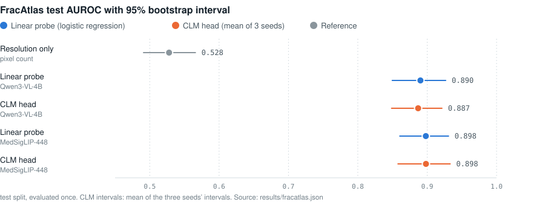

<!-- markdownlint-disable MD001 MD041 -->
<p align="center">
  <picture>
    
  </picture>
</p>

<h3 align="center">
Contrastive Language Models
</h3>

<p align="center">
<i>A System One Model for Fast and Generalizable Decision-Making</i>
</p>

<p align="center">
| 📄 <a href="https://contrastive-lm.notion.site"><b>Blog</b></a> | 🗣️ <a href="https://discord.gg/5dAQEDJBs"><b>Discord</b></a> | 🤗 <a href="https://huggingface.co/Contrastive-LM"><b>Data &amp; Models</b></a> | 📚 <a href="#api-reference"><b>API Reference</b></a> | 🛠️ <a href="#fine-tuning-clm-on-your-own-data"><b>Fine-Tuning Tutorial</b></a> | 🩻 <a href="#vision-fracture-detection-on-x-rays-experimental"><b>X-ray Vision (experimental)</b></a> |
</p>

🔥 **Contrastive Language Models (CLMs)** are a new class of **System One
model** trained with a **contrastive learning** objective that connects
**states and actions**. This repo serves **CLM-8B** behind a
TypeSafe-compatible API.

- **CLM-8B** is pre-trained on **60M Nemotron Q&A pairs**, mid-trained on
  **30M synthetic hard negatives**, and post-trained on **1M agentic
  trajectories**.
- It performs on par with **Jev** across computer-use, gaming and tool-calling
  tasks with up to **9× lower latency**. With lightweight fine-tuning it sets a
  new SOTA as a verifier on agentic coding benchmarks: **Terminal-Bench 2.1
  (87.6%)** and **DeepSWE (81.6%)**.
- **States and actions are disaggregated**, so their embeddings are cached and
  reused independently, which makes training and serving cheap and blazing fast!
- **Experimental: X-ray states.** An independent extension, toward roadmap item 2,
  lets a state be an **X-ray image**: a frozen image encoder (MedSigLIP-448 or
  Qwen3-VL-4B) with a new state head, answering typed questions such as *"Is there
  a bone fracture?"* through the same API. On FracAtlas it reaches **0.898 test
  AUROC** for fractures, answers five questions with one head, and stays robust to
  reworded options. See [X-ray vision](#vision-fracture-detection-on-x-rays-experimental). Research prototype, not a clinical tool.

We invite the community to plug it into their own agents and benchmarks!

---

## Installation

```bash
pip install contrastive-lm
```

To install the latest from a clone:

```bash
pip install -e .
```

---

## Quickstart

### Serve

```bash
# 1. encoder (Qwen3-8B embeddings)
vllm serve Qwen/Qwen3-8B --served-model-name qwen3-8b --runner pooling --max-model-len 2048 --port 8090 &

# 2. CLM API on :8700 (downloads the 75 MB reference head on first run)
clm-serve
```

States longer than 2048 tokens are truncated. For longer states, raise both limits
together, e.g. `--max-model-len 8192` on `vllm serve` and `clm-serve --max-tokens 8192`
(needs more GPU memory).

### Ask typed questions about a state

```python
from clm import CLMClient, Choice, Noul, Score

client = CLMClient()                          # CLM_BASE_URL (default http://127.0.0.1:8700), CLM_API_KEY
r = client.system_one(
    state="Customer: my invoice was charged twice and nobody answers the phone!",
    questions={
        "urgency": Noul(instructions="Is this urgent?"),
        "department": Choice(instructions="Which team should handle this?",
                             criteria={"billing": "Charges, invoices, refunds",
                                       "technical": "Bugs and outages"}),
        "frustration": Score(instructions="How frustrated is the customer?",
                             criteria=["Calm", "Frustrated", "Very angry"]),
    },
)
print(r.answers["urgency"].noul)                # 0.41022     probability the statement is true
print(r.answers["department"].choice)           # billing
print(r.answers["department"].probabilities)    # {'billing': 0.93878, 'technical': 0.06122}
print(r.answers["frustration"].score)           # 1.98386     expected level, 0..2
print(r.usage.input_tokens, r.latency_ms)       # 38 58.1     (106 tokens on a cold cache: option texts are embedded once)
```

Questions may be `Noul` / `Choice` / `Score` objects or plain wire-format
dicts, so a request written for TypeSafe replays as
`client.system_one(state, questions)`.

### Rank candidates directly

`system_one` is built on one primitive: score a candidate against a state.
For free-form candidates (best-of-N answers, tool names, next moves) use the
in-process engine's `rank`:

```python
from clm import Engine

engine = Engine(emb_url="http://127.0.0.1:8090/v1/embeddings")     # reference head, downloaded if missing
engine.rank("What causes tides on Earth?",
            ["The Moon's gravitational pull.", "Photosynthesis in plants.", "Because the Earth is round."])
# [{'rank': 1, 'candidate': "The Moon's gravitational pull.", 'prob': 0.997}, ...]

engine.answer(state, questions)      # the same dict the HTTP endpoint returns, no server needed
```

### Ask about an X-ray (experimental)

A vision head answers typed questions about an image instead of text. Train or
export one, serve it next to the text encoder, then send the image as the state:

```python
from clm import CLMClient, Choice, ImageState

client = CLMClient()
r = client.system_one(
    ImageState(path="xray.jpg"),                  # sent as base64; the server never reads paths
    model="fracatlas-medsiglip",                  # clm-serve --model fracatlas-medsiglip=<checkpoint>
    questions={"fx": Choice(instructions="Is there a bone fracture?",
                            criteria={"fracture": "Radiograph showing an acute bone fracture.",
                                      "no_fracture": "Radiograph of intact bones with no fracture."})},
)
print(r.answers["fx"].choice, r.answers["fx"].probabilities["fracture"])
```

Setup, results, calibration and a notebook: [X-ray vision](#vision-fracture-detection-on-x-rays-experimental).

---

## Playground

`clm-serve` also serves a web UI at `/` (`http://localhost:8700/` by default).
Write a state, add typed questions, and see CLM's answer distributions; every
request is also shown as JSON, `curl` and Python. A **Rank** tab ranks any
candidate set, and links are shareable.

<p align="center">
  <picture>
    
  </picture>
  <br>
  <sub>Captured against a real <code>clm-serve</code> (<code>clm-latest</code>, Qwen3-8B encoder on one RTX 4090).</sub>
</p>

Remote server? `ssh -L 8700:localhost:8700 <host>`. API only: `clm-serve --no-ui`.

---

## Results

### Zero-shot evaluation

<p align="center">
  
</p>

Across **computer-use, gaming and tool-calling tasks**, CLM-8B performs on par
with Jev while running **up to 9× faster**. The speedups are largest when the
number of candidate actions is large (WikiRacing) or when actions are reused
across states (the T-Rex game). The T-Rex benchmark ships in this repo:
see [examples/t_rex](examples/t_rex/README.md).

### Agentic benchmarks: CLM as a verifier

<p align="center">
  
</p>

For each task we sample several candidate solutions (**Opus 5** for DeepSWE,
**Fable 5** for Terminal-Bench 2.1), and CLM or Jev acts as the verifier that
picks the best one. Evaluated on **38 held-out DeepSWE tasks** and **30
held-out Terminal-Bench 2.1 tasks**; latency on an H100. Jev fails to serve as
a verifier for these long-horizon tasks, scoring below pass@1. With lightweight
fine-tuning, CLM reaches SOTA on both (**81.6%** and **87.6%**) while running
**4.1–5.7× faster than Jev**.

---

## Fine-tuning CLM on Your Own Data

See [docs/FINETUNING.md](docs/FINETUNING.md).

```bash
# reproduce the task-disjoint DeepSWE heldout-38 result (31/38 = 81.6%)
hf download Contrastive-LM/deepswe-clm-heads-8k --local-dir heads/deepswe
python evaluation/bon_eval.py --hf-dataset Contrastive-LM/deepswe-clm-embeddings-8k \
    --checkpoint heads/deepswe/best_head.pt \
    --tasks-file heads/deepswe/heldout_tasks.json --n 4 --window 12

# fine-tune the matching DeepSWE head
python train/finetune.py --task clm --init-ckpt "$(clm-download)" --out-dir runs/deepswe \
    --holdout-tasks heads/deepswe/heldout_tasks.json --batch 512

# typed decisions
python train/finetune.py --task choice --data LocalLLaMA/typed-decisions --workflow all \
    --init-ckpt "$(clm-download)" --out-dir runs/typed
```

---

## Vision: fracture detection on X-rays (experimental)

A research prototype, not a clinical tool, and an independent extension of CLM: vision and multimodal support is
item 2 of the [roadmap](#roadmap) above, and this section is one attempt at it on X-rays. CLM can take an
**X-ray image as its state** and
answer "Is there a bone fracture?" as a typed `Choice` / `Noul` question. The state tower is
swapped for a frozen image encoder plus a newly trained `state_head`; the action tower (Qwen3-8B
and the released `action_head`) is unchanged, so the options are ordinary text.

<p align="center">
   frozen image encoder -> L2 norm -> new trainable state_head; option texts -> frozen Qwen3-8B -> released action_head; 100 x cosine, softmax -> p(fracture)" src="assets/clm_vision_arch.svg" width=100%>
</p>

- **State encoders** (frozen, run in-process with `transformers`): Qwen3-VL-4B-Instruct (image +
  "Radiograph for fracture assessment.", last-token hidden state, 2560-d) or MedSigLIP-448
  (pooled image embedding, 1152-d).
- **`state_head`** (the only trained part): the standard CLM head shape, `d → 1536 → 1536 → 512`,
  random init, 7.1M (Qwen3-VL) / 4.9M (MedSigLIP) parameters. Input standardisation used in training
  is folded into its first layer, so the checkpoint keeps the standard format plus
  `cfg.state_encoder`, `cfg.state_modality: "image"` and `cfg.action_hidden_size`.
- **Loss**: class-weighted cross-entropy over the two fixed option embeddings ("Radiograph showing
  an acute bone fracture." / "Radiograph of intact bones with no fracture."); `action_head` and
  `logit_scale` (100) frozen. Not in-batch InfoNCE: with two classes, same-label images would be
  pushed apart as negatives.

### Data: FracAtlas

[FracAtlas](https://figshare.com/articles/dataset/The_dataset/22363012) (CC BY 4.0), 4,083 musculoskeletal
radiographs. **4,022 used, 717 fractured (17.8%)**: 2 images sit in both class folders with empty
fracture annotations (ambiguous, dropped) and 59 JPEGs are truncated in the source zip (all
non-fractured; decoding leaves a grey band that would be a label shortcut, dropped). No patient ids,
so the split is per image: 70/15/15, stratified by label × body region, seed 20261004.

| split | images | fractured | | body region | images | fractured |
|---|---:|---:|---|---|---:|---:|
| train | 2,813 | 499 (17.7%) | | leg | 2,097 | 212 (10.1%) |
| val | 609 | 109 (17.9%) | | hand | 1,254 | 379 (30.2%) |
| test | 600 | 109 (18.2%) | | mixed | 394 | 106 (26.9%) |
| | | | | hip | 179 | 10 (5.6%) |
| | | | | shoulder | 98 | 10 (10.2%) |

### Results (test split, evaluated once)

Every choice (hyperparameters, logistic-regression C, decision threshold, calibration) was made on
val. CLM rows are the mean ± sd over 3 seeds of the best val config (lr 3e-5, weight decay 0.1).
Full tables: [results/fracatlas.md](results/fracatlas.md).

<p align="center">
  
</p>

**Ranking and calibration**

| method | AUROC [95% CI] | sens @ 90% spec | ECE raw | ECE (val Platt) | val AUROC |
|---|---|---:|---:|---:|---:|
| resolution only (log pixel count) | 0.528 [0.491, 0.566] | 0.147 | 0.317 | 0.003 | 0.522 |
| linear probe · Qwen3-VL-4B | 0.890 [0.850, 0.927] | 0.725 | 0.159 | 0.036 | 0.887 |
| **CLM head · Qwen3-VL-4B** | 0.887 ± 0.012 | 0.697 | 0.129 | 0.043 | 0.892 |
| linear probe · MedSigLIP-448 | 0.898 [0.860, 0.931] | 0.743 | 0.118 | 0.020 | 0.898 |
| **CLM head · MedSigLIP-448** | 0.898 ± 0.012 | 0.761 | 0.088 | 0.029 | 0.918 |

**At the decision threshold** (max Youden J on val, applied to test; 109 fractured / 491 intact)

| method | sensitivity | specificity | accuracy | balanced acc. | PPV | NPV | F1 | TP / FP / FN / TN |
|---|---:|---:|---:|---:|---:|---:|---:|---|
| always "no fracture" | 0.000 | 1.000 | 0.818 | 0.500 | – | 0.818 | 0.000 | 0 / 0 / 109 / 491 |
| linear probe · Qwen3-VL-4B | 0.817 | 0.849 | 0.843 | 0.833 | 0.546 | 0.954 | 0.654 | 89 / 74 / 20 / 417 |
| **CLM head · Qwen3-VL-4B** | 0.820 | 0.778 | 0.786 | 0.799 | 0.452 | 0.951 | 0.582 | 89 / 109 / 20 / 382 |
| linear probe · MedSigLIP-448 | 0.771 | 0.859 | 0.843 | 0.815 | 0.549 | 0.944 | 0.641 | 84 / 69 / 25 / 422 |
| **CLM head · MedSigLIP-448** | 0.810 | 0.838 | 0.833 | 0.824 | 0.535 | 0.952 | 0.641 | 88 / 80 / 21 / 411 |

Accuracy is a weak summary at 18% prevalence (answering "no fracture" every time scores 81.8%), so
read AUROC and balanced accuracy. Threshold metrics are derived exactly from the sensitivity and
specificity in `results/fracatlas.json`; CLM counts are seed means, rounded.

**Reading the served answer: calibration.** With `logit_scale` frozen at 100 the raw head is
overconfident: about 90% of its probabilities are below 0.01 or above 0.99, and its best cut sits near
p(fracture) ≈ 1e-5, not 0.5. Its plain `choice` (the more probable option) misses a third or more of
fractures. `train/calibrate_vision.py` fixes this on **val only**: Platt scaling of the logit difference
plus a decision threshold (max Youden J), stored in the checkpoint's `cfg["calibration"]` and applied
by the engine. A calibrated head returns meaningful probabilities, and its `choice` follows the threshold
(the answer carries it as `threshold`). Deployed checkpoints (seed 0) on test:

| served head | AUROC | plain answer: sens / spec / acc. / ECE | calibrated: threshold → sens / spec / acc. / ECE |
|---|---:|---|---|
| MedSigLIP-448 | 0.889 | 0.651 / 0.963 / 0.907 / 0.085 | p ≥ 0.112 → **0.835 / 0.772** / 0.783 / **0.040** |
| Qwen3-VL-4B | 0.900 | 0.596 / 0.937 / 0.875 / 0.116 | p ≥ 0.173 → **0.798 / 0.809** / 0.807 / **0.032** |

Accuracy drops because it rewards answering "no fracture"; the calibrated threshold trades specificity for
catching far more fractures. Use `--min-sensitivity 0.9` (or another target) to pick the threshold by
sensitivity on val instead.

**Does the CLM head add value over a linear probe?** No, not on this task. Paired bootstrap
ΔAUROC (CLM − linear probe, same encoder, same resamples): **−0.003 [−0.026, +0.021]** on
Qwen3-VL-4B and **+0.000 [−0.020, +0.020]** on MedSigLIP. The +0.020 MedSigLIP edge on val did
not hold up on test.

| ablation (CLM head, best config) | Qwen3-VL-4B AUROC | MedSigLIP AUROC |
|---|---:|---:|
| as trained | 0.887 ± 0.012 | 0.898 ± 0.012 |
| trainable `logit_scale` | 0.881 ± 0.003 | 0.903 ± 0.008 |
| no input standardisation | 0.890 ± 0.001 | 0.889 ± 0.007 |
| no class weights | 0.881 ± 0.012 | 0.896 ± 0.003 |
| random option vectors instead of Qwen3-8B text | 0.871 ± 0.011 | 0.894 ± 0.007 |

Random option vectors do as well as the text options, so with two fixed options the text tower adds
no accuracy; the head acts as an MLP classifier. Its value here is the interface: an X-ray is answered
through the same typed-question API and checkpoint format as text.

| test AUROC by region (fractured / images) | hand (57 / 190) | leg (32 / 310) | mixed (16 / 59) | hip* (2 / 27) | shoulder* (2 / 14) |
|---|---:|---:|---:|---:|---:|
| linear probe · Qwen3-VL-4B | 0.855 | 0.880 | 0.844 | 0.980 | 0.958 |
| CLM head · Qwen3-VL-4B | 0.818 | 0.891 | 0.869 | 1.000 | 0.931 |
| linear probe · MedSigLIP-448 | 0.830 | 0.918 | 0.865 | 0.960 | 0.958 |
| CLM head · MedSigLIP-448 | 0.869 | 0.907 | 0.822 | 0.960 | 0.722 |

\* Two fractured test images: not interpretable. Caveats: per-image splits can put one patient's views
in both train and test, so test numbers are optimistic for unseen patients; with 109 fractured test
images the AUROC intervals are about ±0.04, wider than most gaps between methods.

### Multi-question experiment: one head, many typed questions

One state head is trained on five FracAtlas questions at once (fracture, body region, orthopedic hardware,
several scans, fracture count); the three view questions (frontal / lateral / oblique) are held out and
asked zero-shot. Each option has a training wording and two unseen paraphrases. Test macro AUROC:

| | MedSigLIP: trained | MedSigLIP: held out | Qwen3-VL-4B: trained | Qwen3-VL-4B: held out |
|---|---:|---:|---:|---:|
| one CLM head for all questions | 0.952 | **0.496** (zero-shot) | 0.951 | **0.495** (zero-shot) |
| same head, random option vectors | 0.953 | 0.465 | 0.946 | 0.495 |
| one CLM head per question | 0.957 | 0.978 (supervised) | 0.950 | 0.954 (supervised) |
| one linear probe per question | 0.956 | 0.974 (supervised) | 0.948 | 0.951 (supervised) |
| MedSigLIP's own text tower, no training | 0.811 | **0.660** (zero-shot) | – | – |
| CLM head, paraphrased options (wording 1 / 2) | 0.919 / 0.845 | | 0.915 / 0.844 | |
| random option vectors, paraphrased | 0.449 / 0.460 | | 0.501 / 0.545 | |

- **Sharing one head across questions costs nothing and gains nothing** against one probe per question.
- **Zero-shot fails for the CLM head** (chance), although MedSigLIP's own aligned text tower gets 0.660 on the
  same questions with no training: a state head trained from scratch loses the pre-trained image–text alignment.
- **The text tower makes answers robust to rewording**: paraphrased options keep most of the AUROC, while
  random option vectors fall to chance.

**Can the zero-shot ability be kept?** A pre-registered follow-up ([protocol](research/protocol_alignment.md),
[results](results/fracatlas_align_medsiglip.md)) trains the state head on text alone, mapping MedSigLIP text
embeddings of 6,156 template radiograph descriptions onto their CLM action embeddings, then fine-tunes with
that alignment as a regulariser. With no image labels it answers fracture at 0.741 (above MedSigLIP's own
0.659), hardware at 0.892 and region at 0.825, but the held-out view questions stay at chance (0.506), even
when the corpus mentions views; no regulariser weight recovers them. Both hypotheses are not supported.
Research records (log, environment, claims ledger): [research/](research/README.md).

Full tables: [results/fracatlas_multiq_medsiglip.md](results/fracatlas_multiq_medsiglip.md),
[results/fracatlas_multiq_qwen3-vl-4b.md](results/fracatlas_multiq_qwen3-vl-4b.md). Reproduce:

```bash
python train/embed_options.py --multiq             # 60 option texts, Qwen3-8B, one batch (~1 min)
python train/embed_texts_siglip.py                 # MedSigLIP text tower, for its zero-shot baseline
for e in medsiglip qwen3-vl-4b; do
  python train/baselines_vision_multi.py --encoder $e --out-dir runs/fracatlas/multiq/lr-$e
  python train/sweep_vision_multi.py --encoder $e  # val-only grid + controls, ~15 min
  python evaluation/vision_eval_multiq.py --encoder $e --dry-run && python evaluation/vision_eval_multiq.py --encoder $e
done
```

### Reproduce (Apple Silicon or CUDA, no vLLM needed)

Times measured on an Apple M5 Pro laptop (24 GB unified memory, MPS). MedSigLIP is gated: accept its
terms on Hugging Face and log in with a **Read** token (`hf auth login`).

```bash
pip install -r requirements.txt                   # Linux; on a Mac (no vLLM wheel): pip install --no-deps -e .
                                                  #   then the "FracAtlas vision" lines of requirements.txt
python tools/fracatlas_download.py                # 1. data + splits          (340 MB download)
python train/embed_images.py --encoder google/medsiglip-448        # 2. images  ~9 min
python train/embed_images.py --encoder Qwen/Qwen3-VL-4B-Instruct   #            ~39 min, ~12 GB
python train/embed_options.py                     # 3. option texts, Qwen3-8B bf16, ~25 s
python train/sweep_vision.py --encoder medsiglip --ablations       # 4. CLM heads, val-only sweep
python train/sweep_vision.py --encoder qwen3-vl-4b --ablations     #    (120 runs in all, ~12 min)
python train/baselines_vision.py --encoder medsiglip   --out-dir runs/fracatlas/lr-medsiglip    # 5. linear probes
python train/baselines_vision.py --encoder qwen3-vl-4b --out-dir runs/fracatlas/lr-qwen3-vl-4b  #    (seconds)
python evaluation/vision_eval.py --dry-run        # 6. debug on val first; then once on test:
python evaluation/vision_eval.py                  #    -> results/fracatlas.md (~35 s)
python tools/fracatlas_figures.py                 #    -> assets/*.svg
```

Close memory-heavy apps before the Qwen3-VL run on a 24 GB Mac: the embedding script empties the MPS
cache after every batch, but swapping still slows it down several-fold. Every embedding step is
resumable.

### Serve a vision head (with vLLM)

The option texts go through the usual Qwen3-8B vLLM encoder; the image encoder runs inside
`clm-serve` itself (CUDA, then MPS, then CPU; `CLM_IMAGE_DEVICE` overrides). Export the best head,
calibrated on val:

```bash
best=$(python -c "import json; print(json.load(open('runs/fracatlas/sweep/medsiglip/sweep.json'))['best']['dir'])")
python train/calibrate_vision.py --ckpt "$best/s0/best_head.pt" --out checkpoints/fracatlas-medsiglip.pt
python evaluation/vision_eval.py --dry-run --out /tmp/check.md    # optional: served-head numbers on val
```

**One Linux GPU box.** Leave room for the image encoder next to vLLM (MedSigLIP needs ~2 GB, Qwen3-VL-4B ~10 GB):

```bash
vllm serve Qwen/Qwen3-8B --served-model-name qwen3-8b --runner pooling --max-model-len 2048 \
    --gpu-memory-utilization 0.75 --port 8090 &
clm-serve --model fracatlas-medsiglip=checkpoints/fracatlas-medsiglip.pt
```

**Mac + a remote GPU for vLLM.** vLLM runs on the GPU box; `clm-serve` and the image encoder run on the Mac (MPS):

```bash
ssh -N -L 8090:localhost:8090 <gpu-box> &          # vLLM from the command above, on the GPU box
clm-serve --model fracatlas-medsiglip=checkpoints/fracatlas-medsiglip.pt
```

**Locally, without vLLM (quick test on a Mac).** A vision head only needs the Qwen3-8B embeddings of its
two option texts, which `train/embed_options.py` already cached. `tools/options_embedder.py` serves exactly
those on :8090 and refuses any other text (so `clm-latest` won't work against it):

```bash
python tools/options_embedder.py &                 # stands in for vllm serve on :8090
clm-serve --model fracatlas-medsiglip=checkpoints/fracatlas-medsiglip.pt
```

Sample X-rays from the val split (FracAtlas is downloaded by `tools/fracatlas_download.py`):
`data/fracatlas/raw/FracAtlas/images/Fractured/IMG0004376.jpg` (hand, fractured) and
`data/fracatlas/raw/FracAtlas/images/Non_fractured/IMG0003669.jpg` (leg, intact).

Ask about a radiograph. Use the option texts the head was trained with (they are stored in its
`cfg["options"]`); the question's `instructions` do not reach the image encoder.

```bash
curl -s localhost:8700/v1/systemone -H 'content-type: application/json' -d @- <<EOF
{"model": "fracatlas-medsiglip",
 "state": {"type": "image", "image": "$(base64 < data/fracatlas/raw/FracAtlas/images/Fractured/IMG0004376.jpg | tr -d '\n')"},
 "questions": {"fx": {"type": "choice", "instructions": "Is there a bone fracture?",
   "criteria": {"fracture": "Radiograph showing an acute bone fracture.",
                "no_fracture": "Radiograph of intact bones with no fracture."}}}}
EOF
```

```python
from clm import CLMClient, Choice, ImageState

client = CLMClient()
xray = "data/fracatlas/raw/FracAtlas/images/Fractured/IMG0004376.jpg"
r = client.system_one(ImageState(path=xray), model="fracatlas-medsiglip", questions={
    "fx": Choice(instructions="Is there a bone fracture?",
                 criteria={"fracture": "Radiograph showing an acute bone fracture.",
                           "no_fracture": "Radiograph of intact bones with no fracture."})})
a = r.answers["fx"]
print(a.choice, a.probabilities["fracture"], a.threshold)   # choice follows the calibrated threshold
```

A walkthrough with images, a sanity check against the offline numbers and the error cases is in
[examples/fracatlas_vision.ipynb](examples/fracatlas_vision.ipynb). Warm latency per image on the
M5 Pro: MedSigLIP head ~0.2 s; Qwen3-VL-4B head 0.28 s (373×454) to 2.7 s (2304×2880). The Qwen3-8B
option embeddings in serving come from vLLM, while training used `transformers`; expect small
differences in probabilities, which the notebook's sanity check measures.

---

## How it works

### About

CLM first trains a **state encoder** and an **action encoder** on a
large-scale dataset with a contrastive objective (InfoNCE), so that each state
is pulled toward the ground-truth action that was taken and pushed away from
all others. The two encoders then serve directly as a zero-shot action
classifier: at deployment, given the current state and a set of candidate
actions, CLM scores each action by how well its embedding aligns with the
state embedding and selects the highest-scoring action.

That is what this package serves. A typed question is a state plus a closed
set of candidate actions (the options and their descriptions); a softmax over
CLM's scores *is* the answer distribution, and the same call ranks best-of-N
trajectories, routes tools, shortlists retrieval pools and answers typed
decisions with no per-task setup.

**Architecture, data recipe and scaling laws:**

- Each encoder is a frozen LLM backbone plus a 20M-parameter trainable
  projection head, so inference is one
  embedding per fresh text and a dot product per cached candidate.
- CLM is **pre-trained** on internet-scale Q&A, **mid-trained** on synthetic
  hard negatives, **post-trained** on agentic traces, and can be easily
  fine-tuned on downstream tasks ([data recipe](#data-recipe)).
- The InfoNCE loss **decreases predictably as a power law** in training
  compute, model size and dataset size ([details](#scaling-laws-for-verification)).

```
browser ──► clm-serve  (CPU, :8700)   GET / (playground)
client  ──►                          POST /v1/systemone · GET /v1/models · GET /health
               │       state head + action head (20M params, hot-reloaded), embedding cache
               ▼
          vLLM Qwen3-8B pooling server (GPU, :8090)   /v1/embeddings
```

### Training Algorithm

CLM is trained with a bidirectional InfoNCE loss. Given a batch of $B$
matched state–action pairs, we compute a $B \times B$ similarity matrix and,
for each positive pair $(s_i, a_i)$, optimize retrieval in both directions
($s_i \rightarrow a_i$ and $a_i \rightarrow s_i$):

```math
L_{\mathrm{CLM}} = -\frac{1}{2B}\sum_i \left[ \log \frac{\exp\left(s_i^\top a_i/\tau\right)} {\sum_j \exp\left(s_i^\top a_j/\tau\right)} + \log \frac{\exp\left(a_i^\top s_i/\tau\right)} {\sum_j \exp\left(a_i^\top s_j/\tau\right)} \right]
```

For mid-training, the objective is extended with hard negatives. Let
$h_{ik}^{(a)}$ denote a hard negative action for state $s_i$; the
state-to-action direction becomes

```math
L_{s \rightarrow a}^{\mathrm{hard}}=-\frac{1}{B}\sum_i\log\frac{\exp\left(s_i^\top a_i / \tau\right)}{\exp\left(s_i^\top a_i / \tau\right)+\sum_k\exp\left(s_i^\top h_{ik}^{(a)} / \tau\right)}.
```

### Scaling Laws for Verification

The test InfoNCE loss $L$ scales as a power law with training compute $C$,
dataset size $D$, projection-head size $N$ and encoder size
$N_{\mathrm{enc}}$. These dimensions must be scaled jointly for the best
verification performance; when a scale factor is not bottlenecked by the
others, the dependence on each variable $`X \in \{C, D, N, N_{\mathrm{enc}}\}`$
is

```math
L(X) \approx \left(\frac{X_c}{X}\right)^{\alpha_X},
```

where $X_c$ is a fitted scale constant and $\alpha_X$ the corresponding
scaling exponent, following Kaplan et al. Scaling the encoder size yields the
strongest gains. Experiments are conducted on the Nemotron DQA dataset and
evaluated on a held-out set; the fits and figures are in the
[blog post](https://contrastive-lm.notion.site).

**Data vs. optimal model size.** At a fixed compute budget, each iso-FLOP
curve of test loss against head size is well approximated by a parabola in
log-parameter space, and its minimum gives the optimal head size for that data
budget. The optimum grows almost exactly linearly with the number of training
tokens, $N^* \propto D^{1.02}$, at roughly **310 tokens per parameter**.

### Data Recipe

CLM is trained in three stages, each a progressively harder form of
state–action alignment:

1. **Pre-training** on **~60M Nemotron DQA question–answer pairs**, each
   question the state and its answer the action. This learns broad semantic
   representations.
2. **Mid-training** on **~30M synthetic hard negatives** generated by Gemini
   2.5 Flash-Lite: semantically similar but incorrect answers to Nemotron DQA
   questions, added to the InfoNCE loss as above. This develops fine-grained
   discrimination between plausible actions.
3. **Post-training** on **~1M agent trajectories** from the Agent Data
   Protocol (ADP) dataset, plus terminal traces from Endless-Terminals and
   LiteCoder-Terminal-SFT. Each trajectory step is a state–action pair: the
   agent's current context and the decision it took.

**Replay during post-training.** 40% of the post-training mixture is Nemotron
DQA replay and 60% agentic trajectories. With replay, Nemotron hard-negative
top-1 accuracy only moves from 69% to 68.5%; training on agentic data alone for
the same number of agentic steps drops it to 56.2%.

**Why not train on hard negatives from the start?** On ~100K held-out
questions (one gold answer, 10 hard negatives each), pre-training alone reaches
**52.1%** top-1 without seeing a hard negative, and a short mid-training stage
lifts it to **69.2%**. Training with hard negatives from the start improves
quickly but peaks at **62.4%** before overfitting, so the two-stage recipe is
**7 points better** at a fixed budget: hard negatives work best as a refinement
on top of pre-training, not a substitute for it.

The reference head served as `clm-latest` is
[Contrastive-LM/CLM-v0.1-8B](https://huggingface.co/Contrastive-LM/CLM-v0.1-8B)
(`CLM_v0.1-8B.pt`, Qwen3-8B backbone, last-token pooling). Any head in
the same checkpoint format — a `torch.save` dict with `state_head` /
`action_head` state dicts, `logit_scale` and `cfg` (`width`, `depth`,
`projection_dim`, `activation`, `layernorm`, `residual`) — can be served with
`--ckpt`; a head only makes sense with the encoder and pooling it was trained
against.

---

## Roadmap

1. **Scaling experiments:** larger backbones, and how far verification
   performance keeps scaling.
2. **Vision and multimodal support:** images, video and other modalities for
   robotics and computer-use tasks. An independent first attempt for X-rays:
   [X-ray vision](#vision-fracture-detection-on-x-rays-experimental).
3. **Scaling the data recipe:** more pre-training, hard-negative mining and
   agentic post-training.

---

## Citation

If you find CLM useful, please consider citing it:

```bibtex
@misc{kwok2026contrastivelanguagemodels,
  title={Contrastive Language Models: A System One Model for Fast and Generalizable Decision-Making},
  author={Jacky Kwok and Hangoo Kang and Tarun Suresh and Jon Saad-Falcon and Marco Pavone and Christopher Ré and Azalia Mirhoseini},
  year={2026},
  note={Notion Blog},
  url={https://contrastive-lm.notion.site}
}
```

## License

The code in this repository is released under the [Apache 2.0 License](LICENSE). The CLM-8B weights are released under Apache 2.0 on [Hugging Face](https://huggingface.co/Contrastive-LM/CLM-v0.1-8B).

---

## Directory Structure

```
.
├── pyproject.toml               # the clm package (installed editable by requirements.txt)
├── serve_qwen3_8b.sh            # launch the Qwen3-8B pooling encoder on a GPU
├── download_head.sh             # fetch the released head (`clm-download` does the same)
├── assets/                      # logo + the playground screenshot used above
├── src/clm/                     # inference: the package `clm-serve` and `clm` ship
│   ├── __init__.py              #   from clm import CLMClient, Noul, Choice, Score, Engine
│   ├── client.py                #   CLMClient + question / answer types (no torch needed)
│   ├── schema.py                #   question -> (state text, candidate texts); logits -> Answer
│   ├── engine.py                #   Engine.answer(...) / Engine.rank(...): the inference engine
│   ├── heads.py                 #   head architecture, checkpoint load / hot-reload / download
│   ├── embedder.py              #   /v1/embeddings client + LRU cache of normalised embeddings
│   ├── image.py                 #   ImageState: image states (path / base64), no torch needed
│   ├── image_embedder.py        #   image encoders for vision heads, shared with training
│   ├── calibration.py           #   applies a vision head's val-fitted calibration and threshold
│   ├── cache.py                 #   the reserved vector arena behind --action-cache
│   ├── server.py                #   FastAPI app, `clm-serve`
│   └── static/                  #   the playground: index.html + app.css + app.js, no build step
├── tools/playground_mock.py     # serve the playground without a GPU (fake encoder)
├── tools/fracatlas_download.py  # vision: FracAtlas download, cleaning, stratified splits
├── tools/fracatlas_figures.py   # vision: assets/clm_vision_arch.svg + assets/fracatlas_auroc.svg
├── tools/options_embedder.py    # vision: cached option embeddings on :8090, to try a head without vLLM
├── train/                       # fine-tuning
│   ├── finetune.py              #   trains the projection heads on a frozen encoder
│   ├── adapters.py              #   dataset adapters: agentic traces, typed decisions
│   ├── embed_utils.py           #   encoder embeddings with the training token recipe
│   ├── embed_images.py          #   vision: image embeddings (Qwen3-VL / MedSigLIP, MPS or CUDA)
│   ├── embed_options.py         #   vision: option texts through Qwen3-8B + the released action head
│   ├── finetune_vision.py       #   vision: train a state head on image embeddings
│   ├── finetune_vision_multi.py #   vision: one state head on many typed questions (+ sweep / baselines _multi)
│   ├── fracatlas_questions.py   #   vision: the multi-question set, wordings and labels
│   ├── calibrate_vision.py      #   vision: Platt scaling + decision threshold on val -> cfg["calibration"]
│   ├── sweep_vision.py          #   vision: val-only sweep + ablations
│   ├── baselines_vision.py      #   vision: logistic-regression linear probe
│   └── fracatlas_data.py        #   vision: splits + cached embeddings loader
├── evaluation/bon_eval.py            # unified best-of-N evaluation
├── evaluation/vision_eval.py         # vision: one test evaluation -> results/fracatlas.md
├── evaluation/vision_eval_multiq.py  # vision: multi-question evaluation -> results/fracatlas_multiq_<encoder>.md
├── results/fracatlas.md              # vision: FracAtlas test results (+ fracatlas_verdict.md, written by hand)
├── preprocessing/hf_embeddings.py    # embedding dir <-> Hugging Face dataset
├── requirements.txt             # pip install -r requirements.txt  (clm + torch + vLLM + example deps)
├── examples/                    # CLM vs Jev on the T-Rex runner (examples/t_rex/README.md)
│   ├── common.py                #   one client for both endpoints: retries, latency, cache
│   ├── t_rex/                   #   Chrome dinosaur game in real time (run.py --model clm|jev)
│   └── fracatlas_vision.ipynb   #   vision: ask a served vision head about X-rays
└── docs/FINETUNING.md           # the fine-tuning guide
```

This branch carries the inference package, the playground, the fine-tuning script,
the T-Rex example.
The scaling experiments, data pipelines and paper figures
live in the research repo's `main` branch.

---

## API Reference

### `POST /v1/systemone`

| field | |
| --- | --- |
| `state` | string, object or array (objects are rendered as `key: value` text, arrays as `- item` lines; never JSON, the heads are trained on prose) |
| `model` | `clm-latest` (default), `clm-raw`, or any model from `GET /v1/models` |
| `questions` | `{id: Question}`, at least one |
| `temperature` | optional, `(0, 100]`, default 1; divides the logits before the softmax |

| question | required | answer |
| --- | --- | --- |
| `noul` | `instructions`; optional `criteria: {"true": …, "false": …}` | `{"noul": p_true}` |
| `choice` | `instructions` (the question), `criteria: {option: description}` (each option is embedded as its description, or its key when the description is empty) | `{"choice", "confidence", "probabilities"}` |
| `score` | `instructions`, `criteria: [level0, level1, …]` (ordered, ≥2) | `{"score", "confidence", "legend", "probabilities"}` |

- `confidence` = top probability minus the mean of the others.
- `score` = expected level index; `legend` maps indices back to the rubric.
- `usage.input_tokens` counts encoder tokens spent on cache misses;
  `billing_units` is the number of questions.
- Errors: `401` bad key · `422` malformed request or unknown model · `502`
  embedder unreachable. `X-CLM-Latency-Ms` carries the server-side time.

### `POST /v1/rank`

The same primitive in its plain form: `{"context": ..., "question": ..., "answers": [...]}`
returns `{"model", "ranked": [{"rank", "candidate", "prob"}, ...]}`, best first. The
state head sees `context + question`, the action head sees each answer verbatim.
`CLMClient.rank(context, question, answers)` and `Engine.rank(context, answers, question)`
are the client and in-process forms.

### `GET /`

The playground (see [above](#playground)), unless `clm-serve --no-ui`. Static
files only; every API route above shadows it.

### Image states (experimental)

A vision head (checkpoint `cfg.state_modality == "image"`, trained by
`train/finetune_vision.py`) answers questions about an image. Send the state as
`{"type": "image", "image": "<base64 or data: URL>"}`, or pass `ImageState(path=...)`
to `CLMClient` / `Engine` (the client inlines the file as base64; the HTTP server never
reads paths). The image goes through the head's own encoder (`cfg.state_encoder`, loaded
in-process with `transformers` on CUDA, then MPS, then CPU; `CLM_IMAGE_DEVICE` overrides),
with the instruction it was trained on; the question's options go through the text encoder
and action head as usual. A head calibrated by `train/calibrate_vision.py` returns calibrated
probabilities for its trained option pair, and its `choice` follows the stored threshold. A vision head refuses text states and a text head refuses image
states. Training, results and serving instructions:
[Vision: fracture detection on X-rays](#vision-fracture-detection-on-x-rays-experimental).

### `GET /v1/models`

```json
{"models": [{"name": "clm-latest", "description": "...", "release_date": "2026-09-19"},
            {"name": "clm-raw", "description": "Ablation: cosine in the raw encoder space", ...}]}
```

### `clm-serve` options

```
clm-serve [--port 8700] [--emb-url http://127.0.0.1:8090/v1/embeddings] [--emb-model qwen3-8b]
          [--max-tokens 2048] [--ckpt PATH] [--ckpt-dir DIR] [--model NAME=PATH ...] [--device cpu|cuda]
          [--action-cache 0.02|512MiB|0] [--no-ui] [--cors]
```

`--ckpt PATH` serves your own head as `clm-latest` (default: the reference
head in `~/.cache/clm/`, downloaded if missing); `--ckpt-dir DIR` serves every
`*.pt` there under its file stem; `--model NAME=PATH` adds one more.
The heads run on the GPU when torch sees one, else on the CPU; `--device` (or
`CLM_DEVICE`) forces one. Checkpoints hot-reload when the file changes. Set `CLM_API_KEY` to require
`Authorization: Bearer <key>` (the playground has a field for it). Environment
equivalents: `CLM_PORT`, `CLM_EMB_URL`, `CLM_EMB_MODEL`, `CLM_CKPT`,
`CLM_DEVICE`, `CLM_ACTION_CACHE`.

`--no-ui` drops the playground and serves the API alone. `--cors` allows browser
requests from any origin and is off by default, because an API key otherwise
travels in a header any page would then be free to send.

#### The vector cache

An agent asks about a changing state but a mostly fixed set of actions, and it
revisits states it has already seen. Neither their embeddings nor their
projections change while the head does not, so `clm-serve` reserves a slab of
device memory at start-up — the way vLLM claims its KV cache — and keeps them in
it:

```
[clm] vector cache 505.0 MB reserved on cuda (215,764x512d + 3,852x4096d)
```

`--action-cache` takes a fraction of the device (`0.02`, the default), an
absolute size (`512MiB`), or `0` to switch it off; `CLM_ACTION_CACHE` does the
same. It covers states and actions on every served head, and `clm-raw` in the
encoder's own space — the two widths are pools carved from the one allocation,
which never grows, so a long-running server cannot drift into an out-of-memory
kill. Entries are keyed by head and generation, so several heads share the arena
and a hot-reloaded head stops matching rows its previous weights produced;
eviction is least-recently-used. `GET /health` reports occupancy and hit rate.

A hit skips the encoder call, the host-to-device copy and the head's forward
pass. Measured on one RTX 4090, server-side p50, against a fixed action set:

| | 3 actions | 50 actions |
|---|---|---|
| new state every call | 28.6 → 28.0 ms | 28.8 → 28.1 ms |
| revisited states (20 rooms) | 1.7 → 0.6 ms | 2.0 → 0.7 ms |
| one repeated state | 1.7 → 0.6 ms | 2.0 → 0.7 ms |

So a loop that revisits states answers about 2.8x faster, and a loop that never
repeats itself pays the encoder either way. A cached vector costs no encoder
tokens, so `usage.input_tokens` counts only what the encoder actually did.
